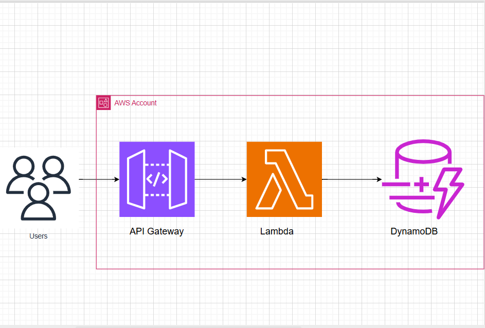
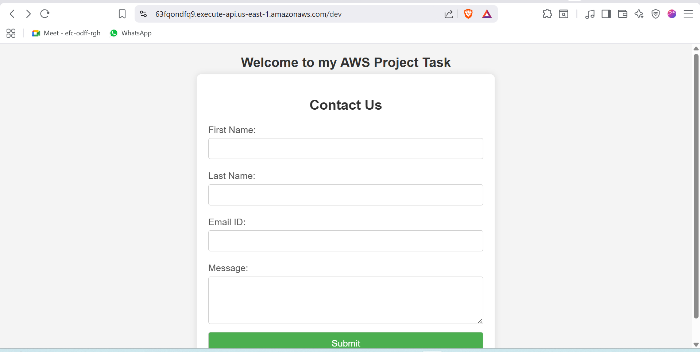

# Lambda-api-gateway-web-application

##  Project Overview

This project demonstrates a **serverless web application** built using **AWS Lambda, API Gateway, and DynamoDB**.
A simple **Contact Us web form** collects user data and stores it securely in DynamoDB using a Lambda backend.

---

## Architecture Diagram



### Architecture Flow

1. User accesses the web application via **API Gateway**
2. **GET** method loads the Contact Us form
3. **POST** method submits user data
4. **AWS Lambda** processes the request
5. **DynamoDB** stores the submitted data
6. Success response is returned to the user

---

##  AWS Services Used

* **AWS Lambda** – Backend logic (Python)
* **Amazon API Gateway** – REST API (GET & POST)
* **Amazon DynamoDB** – NoSQL database
* **AWS IAM** – Role and permission management

---

##  Project Structure

```
Lambda-api-gateway-web-application/
│
├── lambda_function.py        # Lambda backend code
├── contactus.html            # Contact form page
├── success.html              # Success response page
├── screenshots/              # Screenshots & architecture diagram
│   └── architecture-diagram.png
└── README.md
```

---

##  IAM Configuration

* IAM Role: `lambda-api-gateway`
* Policies attached:

  * AmazonDynamoDBFullAccess (demo purpose)
  * AWSLambdaBasicExecutionRole

---

##  DynamoDB Table

* **Table Name:** Web-App-table
* **Partition Key:** email (String)
* Stores user form submissions

---

##  API Gateway Configuration

* **GET Method**

  * Loads the contact form page
* **POST Method**

  * Sends form data to Lambda
* API deployed to **dev stage**

---

##  Lambda Function

* Runtime: **Python**
* Handles:

  * GET → returns HTML page
  * POST → parses form data & writes to DynamoDB
* Uses `boto3` for DynamoDB operations

---

##  Application Output

### Contact Form UI



---

##  Project Screenshots

Screenshots included:

* DynamoDB table
* Lambda function code
* IAM role permissions
* API Gateway GET & POST methods
* Final application output

---

##  Deployment Steps (High Level)

1. Create DynamoDB table
2. Create IAM role
3. Create Lambda function
4. Configure API Gateway
5. Deploy API
6. Access API Gateway URL

---

##  Key Learnings

* Serverless architecture on AWS
* REST API using API Gateway
* Lambda–DynamoDB integration
* IAM roles & permissions
* End-to-end AWS deployment

---

##  Author

**Ramkumar V**
AWS / Cloud Enthusiast

---


